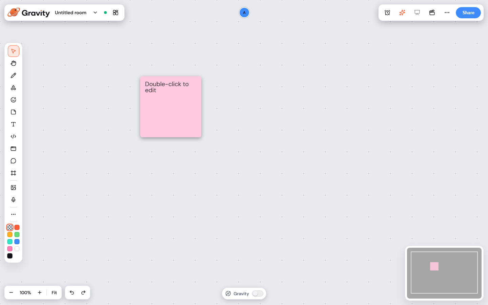
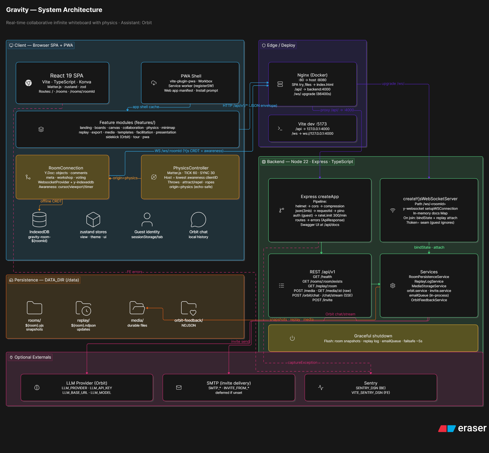

# Gravity

Gravity is a real-time collaborative infinite canvas for whiteboarding, workshops, diagrams, and physics-based facilitation.

Teams can join a shared room, edit the same board, see live presence, work through temporary disconnects, and replay or export the session. Gravity adds physics tools on top of a collaborative canvas: objects can be thrown, clustered, attracted, repelled, settled, and parked in archive wells.



## Features

- Real-time collaborative canvas with Yjs CRDT sync and live cursors
- Infinite pan and zoom, minimap, sticky notes, shapes, connectors, images, voice notes, and code blocks
- Physics tools for throw, collide, attract, repel, wind, topic magnets, archive wells, and board gravity
- Facilitation tools for timers, private brainstorms, voting, reactions, presentation mode, and replay
- Rooms, sharing, link access, invite email queue, comments, and presence
- Export to PNG, SVG, and JSON, with JSON import support
- Offline cache, installable PWA shell, light and dark themes
- Optional Orbit assistant, enabled only when a backend model provider key is configured

## Architecture

```text
frontend/  React, Vite, TypeScript, Konva, Matter.js, Zustand
backend/   Node.js, Express, TypeScript, Yjs WebSocket relay, REST API
docker     Nginx serves the SPA and proxies /api and /ws to the backend
```

Runtime flow:

```text
Browser -> /ws/<roomId>       -> backend Yjs sync and room persistence
Browser -> /api/v1/*          -> health, rooms, media, replay, invites, Orbit
Docker  -> http://localhost:8080
Local   -> frontend :5173, backend :4000
```



## Requirements

- Docker Desktop or Docker Engine with the Compose plugin
- Node.js 20 or newer for local development. Node.js 22 is recommended
- npm, included with Node.js
- Redis is optional for local development and included in Docker Compose

## Environment

Environment files are templates only. They contain empty placeholders for secrets and safe local defaults.

```bash
cp .env.example .env
```

```powershell
Copy-Item .env.example .env
```

Do not commit `.env` or any environment file that contains credentials. The repository ignores `.env` and `.env.*`, while keeping `.env.example` files tracked.

Common optional values:

| Variable | Purpose |
| --- | --- |
| `LLM_API_KEY` | Enables Orbit assistant responses on the backend |
| `SMTP_HOST`, `SMTP_USER`, `SMTP_PASS` | Enables real invite email delivery |
| `INVITE_FROM_EMAIL` | Required with SMTP for invite email delivery |
| `SENTRY_DSN`, `VITE_SENTRY_DSN` | Optional backend and frontend error reporting |
| `APP_PUBLIC_URL` | Public origin used in invite links |
| `CORS_ORIGIN` | Allowed frontend origin for the API |

Frontend variables prefixed with `VITE_` are public at build time. Never put server secrets in `VITE_*`.

## Run With Docker

From the repository root:

```bash
docker compose up --build
```

Open:

| URL | Service |
| --- | --- |
| http://localhost:8080 | Gravity app |
| http://localhost:8080/api/docs | OpenAPI docs |
| http://localhost:8080/api/v1/health | Health check |

Stop the stack:

```bash
docker compose down
```

## Run Locally

Start the backend:

```bash
cd backend
cp .env.example .env
npm install
npm run dev
```

Start the frontend in another terminal:

```bash
cd frontend
cp .env.example .env
npm install
npm run dev
```

Open http://localhost:5173.

For Windows PowerShell, use `Copy-Item .env.example .env` instead of `cp .env.example .env`.

## Tests

Backend:

```bash
cd backend
npm test
npm run test:e2e
```

Frontend:

```bash
cd frontend
npm test
npm run build
```

Browser end-to-end tests expect a running app. With Docker running on `:8080`:

```bash
cd frontend/e2e
npm test
```

To point e2e tests at a different app URL:

```bash
BASE_URL=http://localhost:8080 npm test
```

```powershell
$env:BASE_URL = "http://localhost:8080"
npm test
```

## Deployment Notes

- Build the frontend with `npm run build` in `frontend/`.
- Build the backend with `npm run build` in `backend/`.
- Serve the frontend as static files and proxy `/api` plus `/ws` to the backend.
- Set `APP_PUBLIC_URL`, `CORS_ORIGIN`, `DATA_DIR`, and any provider credentials in the deployment environment.
- Use a persistent volume for backend room data, replay logs, and uploaded media.
- Keep Redis enabled for durable invite queues in production-like environments.
- Terminate TLS at the hosting layer or reverse proxy.

## Security

- No credentials belong in Git.
- Keep `.env` files local or in the deployment secret manager.
- The default `AUTH_MODE=guest` is suitable for local evaluation, not private production boards.
- Validate public deployments before sharing boards with sensitive information.
- `VITE_*` values are visible to browser users.

## Repository Layout

```text
backend/src/       API, config, controllers, services, WebSocket sync, persistence
backend/tests/     Backend unit and integration tests
backend/e2e/       Backend black-box HTTP and WebSocket tests
frontend/src/      React app, canvas, collaboration, physics, replay, export
frontend/e2e/      Browser tests
docs/              Architecture and product screenshots
DESIGN.md          Gravity design guide
CHANGELOG.md       User-facing release notes
```

## Package Docs

- [backend/README.md](backend/README.md)
- [frontend/README.md](frontend/README.md)
